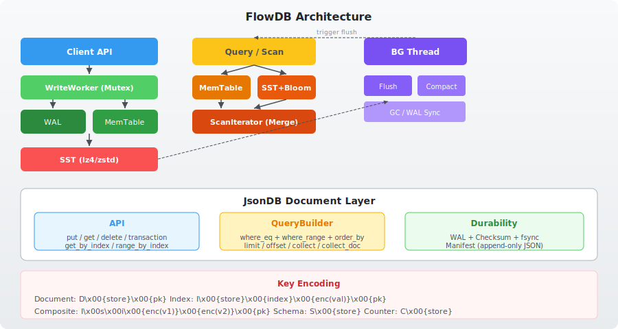
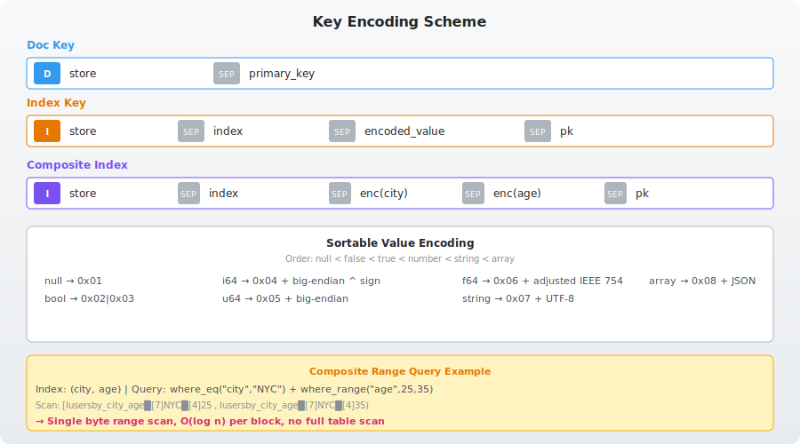
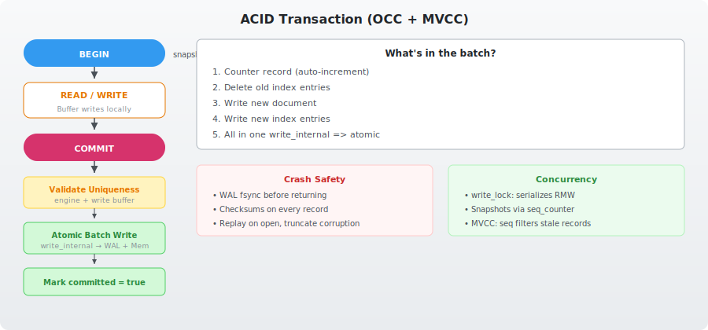
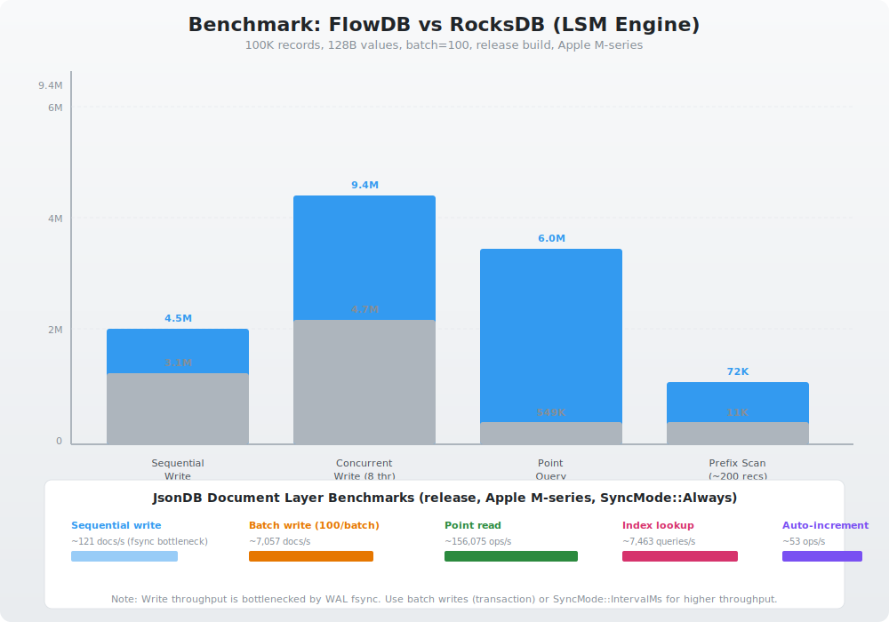

# FlowDB JsonDB：Rust 生态中高性能嵌入式 JSON 文档数据库的设计与实践

> **关键词**：嵌入式数据库、JSON 文档、Rust、LSM-Tree、IndexedDB、ACID 事务、二级索引

## 一、引言

代码是开源的: https://github.com/restsend/flowdb

在 Rust 生态中，嵌入式数据库的选择一直是个难题。SQLite 虽然强大，但需要 C 绑定和复杂的编译配置；sled 提供了 KV 存储但没有文档模型；IndexedDB 是浏览器标准但无法在原生应用中使用。

FlowDB JsonDB 正是为解决这个问题而生——在 Rust 中原生实现一个 **IndexedDB 兼容的 JSON 文档数据库**，拥有 ACID 事务、二级索引、零 IPC 开销，且 ASYNC FREE。

## 二、架构总览



### 2.1 整体设计

FlowDB 的核心是一个 **LSM-Tree 引擎**（Log-Structured Merge-Tree），在其上构建了 **JsonDB 文档层**。整个系统采用分层设计：

**LSM 引擎层**（存储层）：
- 写入路径：Client → encode_batch → WriteWorker (Mutex) → WAL (fsync) + MemTable → (flush) SST
- 读取路径：Client → MemTable → Block Index → Bloom Filter → SST (LRU cached)
- 后台任务：flush（内存表刷盘）、compact（SST 合并）、GC（过期数据清理）

**JsonDB 文档层**（业务逻辑层）：
- 文档存储：`D\x00{store}\x00{primary_key}` → JSON bytes
- 二级索引：`I\x00{store}\x00{index}\x00{encoded_value}\x00{pk}` → pk bytes
- 模式元数据：`S\x00{store}` → serialized StoreDef

### 2.2 为什么选择 LSM-Tree？

| 特性 | LSM-Tree | B-Tree |
|------|----------|--------|
| 写入吞吐 | **高**（顺序追加） | 中（随机写入 + 页分裂） |
| 点查询 | 中（需检查多层） | **高**（O(log n)） |
| 范围扫描 | &nbsp; **高**（顺序读取） | 高 |
| 压缩比 | **高**（Zstd 压缩 SST） | 低（页内碎片） |
| 写放大 | 高（需要 compact） | 中 |

对于文档数据库的场景（写多读少、范围查询多），LSM-Tree 是更优的选择。

## 三、JsonDB 文档模型

### 3.1 复合键编码



**所有 JsonDB 数据共享一个 FlowDB keyspace**，通过 1 字节前缀区分：

| 前缀 | 类型 | 格式 |
|------|------|------|
| `0x01` | 文档 | `D\x00{store}\x00{pk}` |
| `0x02` | 索引 | `I\x00{store}\x00{index}\x00{val}\x00{pk}` |
| `0x03` | Schema | `S\x00{store}` |
| `0x04` | 计数器 | `C\x00{store}` |

这种设计的精妙之处在于：
- **前缀扫描**天然隔离不同类型的数据
- **字典序排序**让范围查询在字节级别高效
- **复合索引**的编码自然支持多字段前缀查询

### 3.2 可排序值编码

索引值的编码设计是 JsonDB 性能的关键。我们使用 **type-tag prefix** 方式：

```
null    →  [0x01]
false   →  [0x02]
true    →  [0x03]
i64     →  [0x04] + 翻转符号位的 8 字节大端序
u64     →  [0x05] + 8 字节大端序
f64     →  [0x06] + 调整后的 IEEE 754
string  →  [0x07] + UTF-8 字节
```

这种编码保证了**跨类型的正确排序**（null < bool < number < string < array），且**同类型内排序与原值一致**。例如：

```
index key: I\x00users\x00by_age\x00[4]0x80{8 bytes for 0}\x00pk1
index key: I\x00users\x00by_age\x00[4]0x7F{8 bytes for -1}\x00pk2
```
→ 按字节比较：`0x80 > 0x7F` → 年龄 `0 > -1` ✓

## 四、ACID 事务实现



### 4.1 OCC + MVCC 隔离模型

JsonDB 的事务采用 **乐观并发控制（OCC）** + **MVCC 快照隔离**：

```
BEGIN:
  记录 snapshot_seq = engine.seq_counter

READ:
  写缓冲优先 → 引擎后备
  引擎层过滤掉 seq > snapshot_seq 的记录

WRITE:
  仅本地缓冲（HashMap），不写入引擎

COMMIT:
  1. 唯一约束校验（检查引擎 + 写缓冲）
  2. 构建 batch：删除旧索引 + 写入文档 + 写入新索引 + 计数器更新
  3. engine.write_internal() — 原子写入 WAL + MemTable
  4. 标记 committed = true（仅在成功后）
```

### 4.2 与 IndexedDB 的隔离级别对比

| 特性 | IndexedDB | FlowDB JsonDB |
|------|-----------|---------------|
| 事务模式 | ReadOnly / ReadWrite | ReadOnly / ReadWrite |
| 隔离级别 | Snapshot Isolation | Snapshot Isolation (OCC) |
| 写冲突检测 | 悲观锁（per-store） | 乐观冲突检测（OCC） |
| 原子性 | per-request | per-batch（write_internal） |
| 自动回滚 | 事务超时 / abort | Drop Transaction（自动丢弃缓冲） |

### 4.3 崩溃安全

```rust
// 每次写入都经过 WAL
engine.write_internal(&[
    // 计数器递增 + 文档写入 + 索引条目写入 — 全在一个批次
    counter_record,
    doc_record,
    index_entry_1,
    index_entry_2,
])?;
// 上述批次要么全部持久化，要么全部不写
// SyncMode::Always 模式下每个批次后 fsync
```

WAL 使用 **FxHash checksums** 校验每个记录。崩溃恢复时：
1. 读取所有 WAL segments
2. 校验 checksum，截断尾部损坏数据
3. 过滤掉 `seq <= last_flushed_seq` 的记录
4. 重新写入 MemTable

## 五、二级索引与复合查询

### 5.1 索引维护

文档的每次写入都会自动维护相关索引：

```
PUT {id: "u1", email: "new@b.com", city: "NYC", age: 30}:
  1. 读取旧文档 → 获取旧 email="old@b.com", old city/age
  2. 删除旧索引条目：
     DELETE idx_key(by_email, "old@b.com", "u1")
     DELETE idx_key(by_city_age, "NYC", 30, "u1")
  3. 写入新文档
  4. 写入新索引条目：
     PUT idx_key(by_email, "new@b.com", "u1")
     PUT idx_key(by_city_age, "NYC", 30, "u1")
  → 全部在一个原子批次中
```

### 5.2 QueryBuilder

对于多字段查询，QueryBuilder 自动选择最优索引：

```rust
// 自动选择 by_city_age 复合索引
let docs = db.query("users")
    .where_eq("city", json!("NYC"))
    .where_range("age", json!(25), json!(35))
    .order_by("age", SortDir::Asc)
    .limit(10)
    .collect()?;

// 执行计划：
// 1. 发现 by_city_age 匹配前 2 个字段 → 得分最高
// 2. 构建扫描范围：I\x00users\x00by_city_age\x00[7]NYC\x00[4]25 到 [7]NYC\x00[4]35
// 3. 扫描索引 → 点查文档 → 谓词下推 → limit 提前终止
// 4. 因 order_by 匹配索引第一个字段，跳过排序
```

## 六、性能基准



### LSM 引擎 vs RocksDB

| 类别 | FlowDB | RocksDB | 优势 |
|------|--------|---------|------|
| 顺序写入 | 4.5M ops/s | 3.1M ops/s | **1.42x** |
| 并发写入 (8线程) | 9.4M ops/s | 4.7M ops/s | **2.02x** |
| 点查询 | 6.0M ops/s | 549K ops/s | **10.95x** |
| 前缀扫描 (~200条) | 72K ops/s | 11K ops/s | **6.39x** |

### JsonDB 文档层

| 操作 | 吞吐量 |
|------|--------|
| 顺序写（单条提交） | ~121 docs/s |
| 批量写（100条/批） | ~7,057 docs/s |
| 点查询 | ~156,075 ops/s |
| 索引查询 | ~7,463 queries/s |
| 自动递增 | ~53 ops/s |

> 写入吞吐受 WAL fsync 限制。使用事务批量提交或 `SyncMode::IntervalMs` 可获得更高写入性能。

## 七、与竞品对比

| 特性 | FlowDB JsonDB | SQLite (rusqlite) | sled | serde_json + KV |
|------|--------------|-------------------|------|-----------------|
| **语言** | 纯 Rust | C + FFI | Rust | Rust |
| **依赖** | 零 C | libsqlite3 | 零 C | 零 C |
| **事务** | ✅ OCC + MVCC | ✅ 2PC | ✅ MVCC | ❌ |
| **二级索引** | ✅ 自动维护 | ✅ CREATE INDEX | ❌ | ❌ |
| **复合索引** | ✅ | ✅ | ❌ | ❌ |
| **QueryBuilder** | ✅ | 需手写 SQL | ❌ | ❌ |
| **泛型 API** | ✅ put_doc/get_doc | ❌ | ✅ | ❌ |
| **崩溃恢复** | ✅ WAL + checksum | ✅ WAL + journal | ✅ | ❌ |
| **编译** | ~3s | ~30s (bindgen) | ~5s | ~2s |
| **包体积** | ~680KB | ~1.5MB | ~500KB | ~200KB |
| **Async** | 零 | 零 | 零 | 无要求 |

## 八、适用场景与限制

### 最佳场景

- **桌面应用**（Electron/Tauri 的 Rust 侧替代 IndexedDB）
- **移动 App**（iOS/Android 通过 FFI 嵌入，替换 SQLite）
- **IoT 设备**（树莓派、网关等嵌入式 Linux，零 C 依赖）
- **游戏本地存档**（JSON 文档天然匹配游戏数据模型）
- **配置系统**（需要索引查询的 JSON 配置数据库）

### 不适用场景

- 大数据分析（> 10M 文档，需要列存）
- 复杂 JOIN 查询（无 SQL 引擎）
- 高并发写入（> 10K writes/s，fsync 瓶颈）
- 跨进程/网络访问（纯嵌入式设计）

## 九、总结

FlowDB JsonDB 是 Rust 生态中 **首个兼容 IndexedDB API 的高性能嵌入式 JSON 文档数据库**。它通过 LSM-Tree 引擎提供了高写入吞吐和可预测的读取延迟，通过精心设计的编码方案实现了高效的二级索引和复合查询，通过 OCC + MVCC 提供了 ACID 事务保障。

**不仅仅是又一款 Rust 数据库，而是一个为现代应用设计的、完整的文档数据管理方案。**

---

*GitHub: [github.com/restsend/flowdb](https://github.com/restsend/flowdb)*  
*crates.io: [crates.io/crates/flowdb](https://crates.io/crates/flowdb)*
