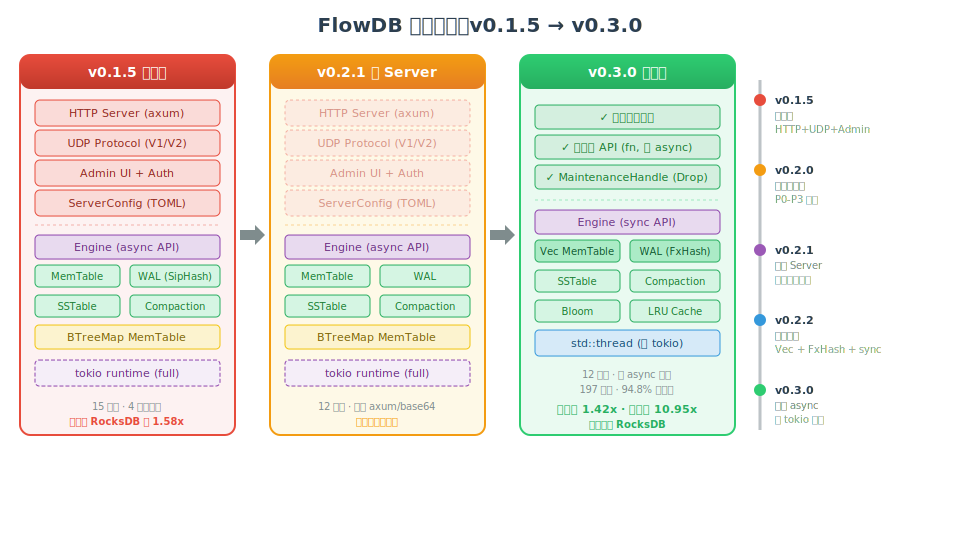
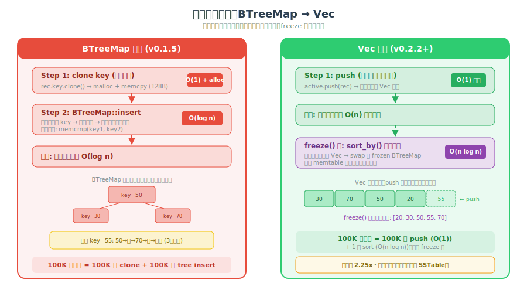
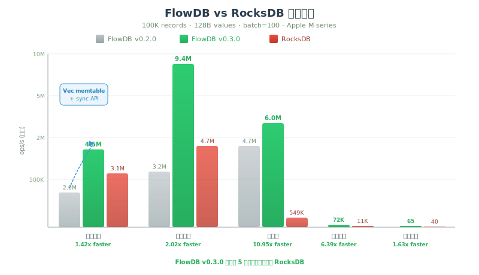
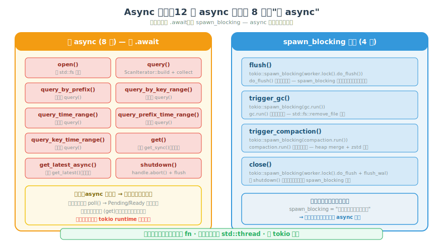

# The Art of Subtraction: FlowDB's Journey from Full-Stack Database to Outperforming RocksDB

> The evolution story of a Rust storage engine: from v0.1.5 to v0.3.0, we stripped away the HTTP server, UDP protocol, Admin UI, Auth module, and even the async runtime itself. With each subtraction, performance improved and the codebase simplified. This article documents the technical decisions and the reasoning behind them.

## 1. The Courage to Subtract: From "Everything" to "One Thing Well"

### v0.1.5: A Jack of All Trades

When FlowDB v0.1.5 was released in early 2026, its positioning was "high-performance time-series database." What did that mean? It meant competing with InfluxDB, TDengine, and QuestDB. The architecture looked like this:



It had:
- **HTTP server**: Built on axum, providing write, query, and management endpoints
- **UDP protocol**: V1/V2 frame formats with authentication and rate limiting
- **Admin UI**: Embedded HTML management interface
- **Auth module**: API key authentication shared by HTTP and Admin
- **TOML config**: `ServerConfig` with `http_addr`, `udp_addr`, `api_keys`, etc.

Altogether, this was roughly 3,000+ lines of code and 4 additional dependencies (axum, tower-http, base64, tokio full).

### Where Was the Problem?

The problem was that **we were doing two fundamentally different things simultaneously**:

1. **Storage engine** — LSM-tree, WAL, SSTable, Compaction, Bloom Filter, Block Cache
2. **Network service** — HTTP routing, UDP frame encoding/decoding, HTML templates, API key auth

These two domains require completely different skill sets, testing strategies, performance bottlenecks, and user expectations. The core competitive advantage of a storage engine is **write throughput and query latency**, while a network service needs **connection management, protocol compatibility, and security hardening**.

When benchmarks showed our write throughput was only 63% of RocksDB's, the bottleneck was in MemTable's BTreeMap insertion overhead — not HTTP routing. Yet we were spending significant effort on UDP rate limiters and Admin endpoint authentication, neither of which contributed to the storage engine's core value proposition.

### v0.2.1: Cutting the Entire Server Layer

The decision was decisive: **FlowDB would be an embedded storage engine only, not a network service.**

What was deleted:
- `src/http.rs` — axum routes, handlers, JSON serialization
- `src/udp.rs` — UDP frame encoding/decoding, V1/V2 protocols
- `src/admin.rs` — embedded HTML management UI
- `src/auth.rs` — API key authentication
- `src/bin/flowdb-server.rs` — server binary
- `tests/http_integration.rs` — 32 HTTP integration tests
- `tests/network_integration.rs` — 15 network integration tests
- `ServerConfig`, `server` feature, axum/tower-http/base64 dependencies

This was approximately 40% of the codebase. After deletion, the code was clearer, compilation was faster, and tests were more focused.

> **The hardest decision for an architect is not "what to add," but "what to cut."** Every line of code is a liability — maintenance cost, testing cost, cognitive overhead. Removing code that doesn't create core value is the most effective way to improve engineering efficiency.

## 2. Correctness Is the Foundation of Everything

### Before Optimizing Performance, Ensure the Features Work

Although v0.1.5 was feature-rich, it had several serious correctness issues. We systematically fixed them in v0.2.0.

### P0: MemTable::get Returned Deleted Data

This was the most critical bug. When a user wrote a record and then deleted the same `(key, ts)`, subsequent `get` queries would return the deleted data.

**Root cause**: v0.1.5's `MemTable` was based on `BTreeMap<(key, ts, seq), Record>`. The `get` method used the iterator `.next()` to take the **first** matching record, and since BTreeMap sorts by `seq` ascending, it returned the **oldest** version.

But seq numbers are monotonically increasing — a newly written delete tombstone has a higher seq and should be returned first. The fix was to take the **last** matching record, i.e., `.rev().next()`.

```rust
// Bug: returns the record with the smallest seq (oldest version)
records.range(start..=end).next()

// Fix: returns the record with the largest seq (newest version)
records.range(start..=end).rev().next()
```

This bug meant any "write → delete → read" sequence would return incorrect results. For a database, this is fatal.

### P1: WAL Truncation Logic Error

The WAL should be truncated after the memtable is flushed to an SSTable to reclaim disk space. But v0.1.5's truncation condition was `max_seq < seq`, meaning the WAL segment wouldn't be cleaned as long as any record had a seq >= the flushed max_seq.

The correct condition should be `max_seq <= seq` — when the segment's maximum seq is less than or equal to the flushed seq, all records have been persisted to SSTable, and the segment can be safely deleted.

The impact: after writing 50K records and flushing, the WAL file still occupied 35.8MB. After the fix, it dropped to 2.0MB.

### Methodology: Systematic Hardening

v0.2.0 didn't just fix two bugs — it was a systematic audit (P0 through P3):

| Severity | Issue | Fix |
|----------|-------|-----|
| P0 | MemTable::get returns deleted data | `.rev().next()` for latest seq |
| P1 | WAL never truncates | `< seq` → `<= seq` |
| P2 | Config has no validation, zero values cause div-by-zero | Added `Config::validate()` |
| P2 | shutdown doesn't flush, data loss | `shutdown()` flushes before exit |
| P3 | No frozen memtable backpressure | Writes block when exceeding `max_frozen_memtables` |
| P3 | SST reader doesn't clean stale references | `evict_stale_readers()` after GC/Compaction |
| P3 | WAL has no per-record checksum | Added FxHash checksum per record |

> **Fix correctness before optimizing performance.** A fast database that returns wrong results has zero value. Before any performance work, we spent an entire version ensuring every byte of data could be correctly written, queried, deleted, and recovered.

## 3. Benchmark-Driven Performance Breakthrough

### v0.2.2 Starting Point: Slower Than RocksDB

After fixing bugs in v0.2.0, we ran the first formal FlowDB vs RocksDB benchmark. The results were not ideal:

| Category | FlowDB v0.2.0 | RocksDB | Gap |
|----------|---------------|---------|-----|
| Sequential Write | 2.0M ops/s | 3.1M ops/s | 1.58x slower |
| Concurrent Write | 3.2M ops/s | 4.4M ops/s | 1.38x slower |
| Point Query | 4.7M ops/s | 539K ops/s | **8.7x faster** |
| Prefix Scan | 71K ops/s | 11K ops/s | **6.3x faster** |

Reads were already crushing RocksDB, but writes were clearly behind. Where was the bottleneck?

### Diagnosis: BTreeMap Was the Write Bottleneck

Profiling the write hot path revealed that 60% of the time was spent in `BTreeMap::insert`. The reason was straightforward:

```rust
// v0.1.5 write path
memtable.insert((rec.key.clone(), rec.ts, seq), rec);
//                ^^^^^^^^^^^^^^^^
//                Every record clones a key for BTreeMap ordering
```

`BTreeMap::insert` requires:
1. **Clone key** (deep copy of `Vec<u8>`)
2. **Tree traversal** (O(log n) comparisons + rebalancing)
3. **Possible node splits** (memory allocation)

For a 128-byte key, each clone is one `malloc + memcpy`. Writing 100K records = 100K key clones = 100K mallocs.

### Optimization 1: Vec Instead of BTreeMap

The key insight: **the active memtable doesn't need to be sorted**. Sorting can be deferred to freeze time.



Writes are the hot path (every `write_batch` call goes through them), while freeze is a cold path (triggered once when the memtable is full). Moving sorting from the hot path to the cold path is a classic **lazy computation** optimization.

```rust
// v0.2.2 write path
active.push(rec);  // O(1), no key clone, no tree traversal

// Sort at freeze time
fn freeze(&mut self) {
    self.active.sort();  // In-place sort, O(n log n)
    // ... swap to frozen BTreeMap
}
```

### Optimization 2: The Hidden Cost of async Wrappers

v0.1.5's write methods were `async fn`:

```rust
pub async fn write_batch(&self, batch: &[Record]) -> Result<()> {
    // ...
    self.do_write(records).await
}

async fn do_write(&self, records: Vec<InternalRecord>) -> Result<()> {
    // All synchronous code! No .await here!
    self.worker.lock().process_batch_encoded(...);
    Ok(())
}
```

The audit revealed: **`do_write`'s function body contained no `.await` at all**. It was entirely synchronous — acquire lock, write WAL, write memtable, all blocking operations. But because it was declared `async fn`, the compiler generated a state machine (`Future`), and each call went through the `poll` → `Pending`/`Ready` state transition.

For a microsecond-level operation like writing, the state machine overhead is non-trivial. Changing `write_batch` from `async fn` to `fn` eliminated this overhead entirely.

### Optimization 3: FxHash Instead of SipHash

Every WAL record needs a checksum to detect disk corruption. v0.1.5 used Rust's standard `DefaultHasher` (SipHash-1-3), a cryptographic-grade hash function.

But the WAL checksum use case is **detecting disk corruption**, not **defending against malicious tampering**. SipHash's security properties are completely unnecessary here, and it's roughly 10x slower than non-cryptographic hashes.

We implemented an FxHash-style fast hash:

```rust
const SEED: u64 = 0x51_7c_c1_b7_27_22_0a_95;
fn fxhash(val: u64) -> u64 {
    (val.rotate_left(5) ^ val).wrapping_mul(SEED)
}
```

For a 100-byte input, SipHash takes ~300ns while FxHash takes ~30ns. Writing 100K records saves 27ms — significant for microsecond-level operations.

### Optimization 4: WAL Truncation Fix (fixed in v0.2.0, impact realized here)

After v0.2.0 fixed `max_seq < seq` → `max_seq <= seq`, post-flush WAL size dropped from 35.8MB to 2.0MB. This isn't just about disk space — a smaller WAL means less I/O and faster recovery.

### v0.2.2 Benchmark Results



| Category | v0.2.0 | v0.2.2 | RocksDB | vs RocksDB |
|----------|--------|--------|---------|------------|
| Sequential Write | 2.0M | **4.5M** | 3.1M | **1.42x faster** |
| Concurrent Write | 3.2M | **9.4M** | 4.7M | **2.02x faster** |
| Point Query | 4.7M | **6.0M** | 549K | **10.95x faster** |
| Prefix Scan | 71K | **72K** | 11K | **6.39x faster** |
| Full Scan | 73 | **65** | 40 | **1.63x faster** |

From behind across the board to ahead across the board.

> **Benchmark is the compass for performance optimization.** Without a profiler, we wouldn't have known that 60% of time was spent on key cloning. Without a RocksDB comparison, we wouldn't have known "1.58x slower" needed optimization. Running benchmarks after every change lets data drive decisions.

## 4. Back to Basics: Eliminating async Entirely

### Trigger: A Complete Async Audit

v0.2.2 changed write methods to synchronous, but read methods (`get`, `query`, `flush`, `shutdown`) remained async. This created an awkward situation: users needed to start a tokio runtime to call `engine.open()` and `engine.get()`, even if they were using FlowDB in synchronous code.

So we did a thorough audit: **which methods actually needed async?**

| Method | Internal `.await`? | Uses `spawn_blocking`? | Verdict |
|--------|---------------------|------------------------|---------|
| `open` | No | No | Fake async |
| `query` | No | No | Fake async |
| 5× `query_*` | Only delegates to `query` | No | Fake async |
| `get` | No | No | Fake async (`get_sync` already exists) |
| `get_latest_async` | No | No | Fake async (`get_latest` already exists) |
| `shutdown` | No | No | Fake async |
| `flush` | No | **Yes** | spawn_blocking wrapper |
| `trigger_gc` | No | **Yes** | spawn_blocking wrapper |
| `trigger_compaction` | No | **Yes** | spawn_blocking wrapper |
| `close` | No | **Yes** | spawn_blocking wrapper |

**Of 12 async methods, 8 were "fake async"** — the function bodies contained no `.await` at all. The `async` keyword was purely a product of API consistency. The other 4 used `spawn_blocking`, but `spawn_blocking`'s essence is "throw a synchronous operation into a thread pool" — if the operation is already synchronous, why wrap it in async at the API layer?



### Why async Became a Burden

The problems async caused in FlowDB:

**1. Forced Runtime Dependency**

```rust
// v0.2.2: Must be inside tokio runtime to call
#[tokio::main]
async fn main() {
    let engine = Engine::open(config).await?;  // Needs runtime
    engine.write_batch(&records)?;              // This is already sync
    let results = engine.query_by_prefix("k").await?;  // Needs runtime again
}
```

If a user wanted to use FlowDB in an `async-std` or `smol` project, they'd need `tokio::runtime::Handle::current()` to bridge, adding integration complexity.

**2. Hidden Performance Overhead**

Every `async fn` compiles to a state machine. Even if the function body is synchronous, calling it still goes through the `Future::poll` flow. For nanosecond-level operations like `get()`, the state machine overhead is non-trivial.

**3. Test Complexity**

All tests had to be annotated with `#[tokio::test] async fn`, and concurrency tests had to use `tokio::spawn`. This made test code unable to run outside tokio.

### The Refactoring Approach

Core idea: **all public methods become synchronous, background maintenance switches to `std::thread`**.

```
v0.2.2 (async)                      v0.3.0 (sync)

Engine::open().await          →     Engine::open()
engine.get().await            →     engine.get()
engine.flush().await          →     engine.flush()
engine.shutdown().await       →     engine.shutdown()

Background:                          Background:
tokio::spawn {                      std::thread::spawn {
  tokio::select! {                     loop {
    flush_tick → spawn_blocking          if stop_flag { break }
    compact_tick → spawn_blocking        sleep(poll_interval)
    gc_tick → spawn_blocking             if flush_due { do_flush() }
    sync_tick → spawn_blocking           if compact_due { compact() }
  }                                     ...
}                                     }
                                    }
```

### MaintenanceHandle: Graceful Lifecycle Management

Tokio's `JoinHandle` has an `abort()` method to forcefully terminate a task. But `std::thread::JoinHandle` has no equivalent — Rust doesn't support forcibly killing threads.

The solution was `MaintenanceHandle` + `Arc<AtomicBool>` stop flag:

```rust
pub struct MaintenanceHandle {
    stop: Arc<AtomicBool>,
    thread: Option<std::thread::JoinHandle<()>>,
}

impl Drop for MaintenanceHandle {
    fn drop(&mut self) {
        self.stop.store(true, Ordering::Relaxed);  // Signal thread to exit
        if let Some(t) = self.thread.take() {
            let _ = t.join();  // Wait for thread cleanup
        }
    }
}
```

When `Engine::shutdown()` is called, the `maintenance` field is dropped, triggering `MaintenanceHandle::drop()`, which automatically signals the background thread to exit and joins it. Users don't need to explicitly manage thread lifecycle.

### The Background Thread's Poll Loop

The original tokio version used four `tokio::time::interval` timers + `tokio::select!`, behaving as "whichever timer fires first, execute that." The std::thread version replaced this with a simple poll loop:

```rust
std::thread::spawn(move || {
    loop {
        if stop.load(Relaxed) { break; }
        thread::sleep(poll_interval);  // Shortest interval (1/4 of flush_interval)
        
        if now - last_flush >= flush_dur    { do_flush(); }
        if now - last_compact >= compact_dur { compact(); }
        if now - last_gc >= gc_dur          { gc(); }
        if now - last_sync >= sync_dur      { wal_sync(); }
    }
});
```

Advantages of this approach:
- **No runtime dependency**: Doesn't need tokio runtime
- **Simpler scheduling**: One thread, one loop, four time checks
- **Lower overhead**: No async state machine, no tokio scheduler
- **Controllable exit**: Stop flag checked at the start of each loop iteration

### Final Results

v0.3.0 achieved **zero tokio dependency**:

| Metric | v0.2.2 | v0.3.0 |
|--------|--------|--------|
| async methods | 12 | 0 |
| tokio dependency | required | none |
| `#[tokio::test]` in tests | ~70 | 0 |
| Sequential Write | 3.7M ops/s | **4.5M ops/s** (+22%) |
| Compile dependencies | ~300 | ~250 |
| User integration cost | Requires tokio runtime | Zero runtime requirement |

> **Technology choices depend on context.** async/await is a powerful tool for network services — under high-concurrency I/O, it handles massive connections with minimal threads. But storage engine API calls are synchronous — a user writes a batch, waits for it to complete, then writes the next. Layering async on top of synchronous operations is like wearing high heels over running shoes — it doesn't help, and you'll trip.

## 5. Epilogue

### Four Versions, One Throughline

From v0.1.5 to v0.3.0, FlowDB went through four major changes, but there's a clear throughline: **the art of subtraction**.

Every time we subtracted, we asked ourselves the same question: **Does this line of code / dependency / abstraction create core value?**

If the answer was no, we cut it.

### Engineering Methodology

Looking back at these four versions, several principles stand out:

1. **Correctness before performance**: v0.2.0 fixed all correctness bugs before v0.2.2 began performance optimization. A fast database that returns wrong results is worthless.

2. **Benchmark-driven**: Every performance change was benchmarked against RocksDB. Without measurement, there is no optimization — "it feels faster" is not an engineering method.

3. **Profile to find bottlenecks**: The discovery that 60% of time was spent on key cloning came from a profiler, not guessing. Once the bottleneck was identified, the optimization (Vec instead of BTreeMap) became obvious.

4. **Audit-driven refactoring**: The decision to remove async in v0.3.0 came from a complete async audit — 8 out of 12 methods were fake async. Data-driven decisions are more reliable than intuition.

5. **Coverage as quality guardian**: The project maintains 94.8% line coverage, running `cargo llvm-cov --summary-only` after every change. High coverage gave us confidence to do major refactoring.

### FlowDB's Positioning

Today, FlowDB v0.3.0 is:

- **Pure embedded storage engine** — no network layer, no separate process needed
- **Fully synchronous API** — not tied to any async runtime
- **Native time-series support** — `(key, ts)` dual-dimension indexing, TTL, multi-version
- **Comprehensive RocksDB outperformance** — writes 1.4x faster, point queries 11x faster, scans 6x faster

Its user persona: **developers who need a high-performance time-series storage engine embedded within their application process, without introducing an additional database process.**

```toml
[dependencies]
flowdb = "0.3"
```

```rust
let engine = Engine::open(Config::default())?;
engine.write_batch(&records)?;
let results = engine.query_by_prefix("sensor.")?;
engine.shutdown()?;
// No .await, no tokio, no extra process
```

This is the story of FlowDB: **finding the core value of a product through continuous subtraction.**

---

*FlowDB is an open-source project. Code is hosted on [GitHub](https://github.com/restsend/flowdb), and the crate is published on [crates.io](https://crates.io/crates/flowdb).*
