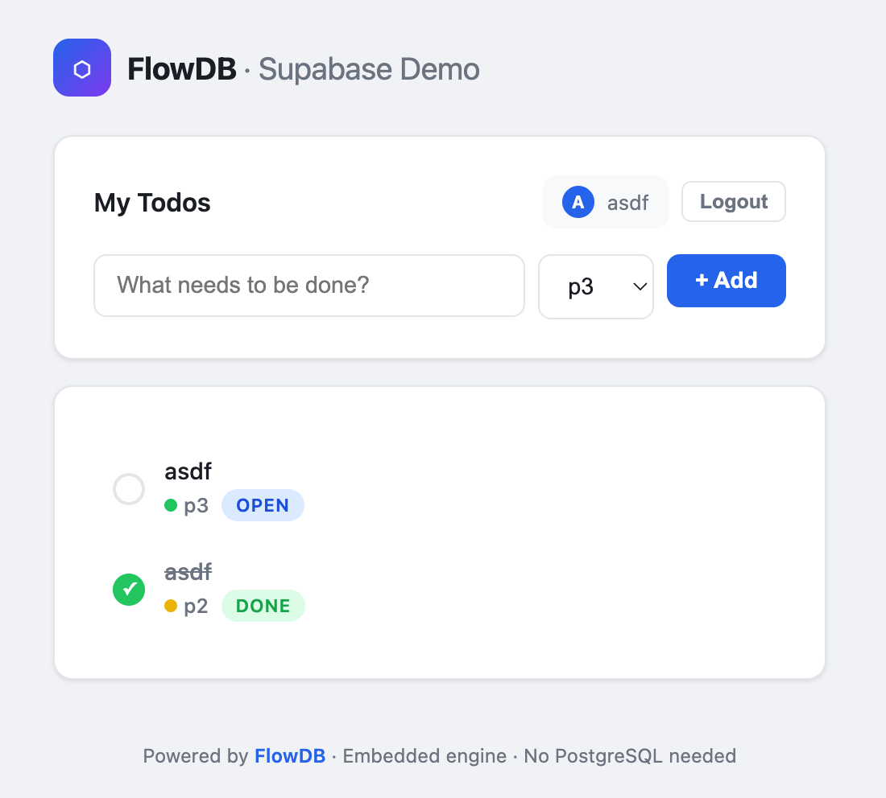

# FlowDB Supabase Server — Web UI with Axum

[« Back to Tutorials](../index.md)

---

In this tutorial, you'll build a **Supabase-like API server** with an HTML/JS web UI using **Axum** on top of FlowDB's JsonDB layer.

By the end, you will have:

- A REST API for user auth (signup/login) and todo CRUD
- Row-Level Security (RLS) enforced on every request
- A single-page web UI that consumes the API
- Everything running in a single binary — no PostgreSQL, no Docker

> **Source code**: [`examples/supabase-server.rs`](https://github.com/restsend/flowdb/blob/main/examples/supabase-server.rs)
> **UI template**: [`examples/supabase-ui.html`](https://github.com/restsend/flowdb/blob/main/examples/supabase-ui.html)



---

## Step 1 — Dependencies

Add to `Cargo.toml`:

```toml
[dependencies]
flowdb = "0.6"
serde = { version = "1", features = ["derive"] }
serde_json = "1"
tokio = { version = "1", features = ["full"] }
axum = "0.8"
tower-http = { version = "0.6", features = ["cors"] }
tracing-subscriber = "0.3"
tempfile = "3"
```

---

## Step 2 — Application State

```rust
use std::sync::Arc;
use flowdb::jsondb::JsonDB;

struct AppState {
    db: JsonDB,
}
```

We'll wrap `AppState` in `Arc` so it can be shared across handler closures.

---

## Step 3 — Request / Response Types

```rust
use serde::{Deserialize, Serialize};

#[derive(Deserialize)]
struct SignUpReq { email: String, password: String }

#[derive(Serialize)]
struct AuthRes { user_id: String, token: String }

#[derive(Deserialize)]
struct LoginReq { email: String, password: String }

#[derive(Deserialize)]
struct CreateTodoReq {
    title: String,
    #[serde(default = "default_priority")]
    priority: i64,
}

fn default_priority() -> i64 { 0 }

#[derive(Deserialize)]
struct UpdateTodoReq {
    title: Option<String>,
    status: Option<String>,
    priority: Option<i64>,
}
```

These are the JSON payloads for each endpoint. Using `Option` for update fields lets the client send partial updates.

---

## Step 4 — Auth Helpers

```rust
fn uuid_v4() -> String {
    use std::sync::atomic::{AtomicU64, Ordering};
    static COUNTER: AtomicU64 = AtomicU64::new(1);
    let n = COUNTER.fetch_add(1, Ordering::Relaxed);
    format!("{:08x}-{:04x}-4{:03x}-{:04x}-{:012x}", n, 0, 0, 0, 0)
}
```

A deterministic UUID generator (for reproducibility). In production, use the `uuid` crate.

```rust
fn extract_user_id(auth: &str, db: &JsonDB) -> Result<String, StatusCode> {
    let token = auth
        .strip_prefix("Bearer ")
        .ok_or(StatusCode::UNAUTHORIZED)?;
    let session = db
        .get("sessions", &json!(token))
        .map_err(|_| StatusCode::INTERNAL_SERVER_ERROR)?
        .ok_or(StatusCode::UNAUTHORIZED)?;
    session["user_id"]
        .as_str()
        .map(String::from)
        .ok_or(StatusCode::UNAUTHORIZED)
}
```

This extracts the `Bearer` token from the `Authorization` header, looks up the session in JsonDB, and returns the `user_id`.

---

## Step 5 — Database Schema

When the server starts, initialise the object stores and indexes:

```rust
db.create_object_store("users", "id").unwrap();
db.create_index("users", "by_email", &["email"], true).unwrap();

db.create_object_store("sessions", "token").unwrap();
db.create_index("sessions", "by_user", &["user_id"], false).unwrap();

db.create_object_store("todos", "id").unwrap();
db.create_index("todos", "by_user_status", &["user_id", "status"], false).unwrap();
db.create_index("todos", "by_user_priority", &["user_id", "priority"], false).unwrap();
```

---

## Step 6 — Auth Handlers

### Sign Up (POST /api/signup)

```rust
async fn signup_handler(
    State(state): State<Arc<AppState>>,
    Json(req): Json<SignUpReq>,
) -> Result<Json<AuthRes>, StatusCode> {
    let user_id = uuid_v4();
    let token = uuid_v4();

    let mut tx = state
        .db
        .transaction(&["users", "sessions"], TransactionMode::ReadWrite)
        .map_err(|_| StatusCode::INTERNAL_SERVER_ERROR)?;

    tx.put("users", json!({
        "id": user_id, "email": req.email,
        "password": req.password, "created_at": now_iso(),
    })).map_err(|_| StatusCode::CONFLICT)?;

    tx.put("sessions", json!({
        "token": token, "user_id": user_id, "created_at": now_iso(),
    })).map_err(|_| StatusCode::INTERNAL_SERVER_ERROR)?;

    tx.commit().map_err(|_| StatusCode::INTERNAL_SERVER_ERROR)?;
    Ok(Json(AuthRes { user_id, token }))
}
```

Key points:
- An explicit **transaction** ensures the user + session are created atomically.
- If the email is a duplicate, the unique `by_email` index causes `put` to return `Err`, which we map to `409 CONFLICT`.

### Login (POST /api/login)

```rust
async fn login_handler(
    State(state): State<Arc<AppState>>,
    Json(req): Json<LoginReq>,
) -> Result<Json<AuthRes>, StatusCode> {
    let users = state.db
        .get_by_index("users", "by_email", &json!(req.email))
        .map_err(|_| StatusCode::INTERNAL_SERVER_ERROR)?;

    let user = users.into_iter().next().ok_or(StatusCode::UNAUTHORIZED)?;
    if user["password"] != req.password {
        return Err(StatusCode::UNAUTHORIZED);
    }
    let user_id = user["id"].as_str().unwrap();
    let token = uuid_v4();

    state.db.put("sessions", json!({
        "token": token, "user_id": user_id, "created_at": now_iso(),
    })).map_err(|_| StatusCode::INTERNAL_SERVER_ERROR)?;

    Ok(Json(AuthRes { user_id: user_id.to_string(), token }))
}
```

The `by_email` unique index makes email lookup fast — O(log n) in the number of users.

---

## Step 7 — Todo Handlers

### List Todos (GET /api/todos)

```rust
async fn list_todos_handler(
    State(state): State<Arc<AppState>>,
    headers: HeaderMap,
) -> Result<Json<Vec<serde_json::Value>>, StatusCode> {
    let auth = headers.get("authorization").and_then(|v| v.to_str().ok())
        .ok_or(StatusCode::UNAUTHORIZED)?;
    let user_id = extract_user_id(auth, &state.db)?;

    let todos = state.db.query("todos")
        .where_eq("user_id", json!(user_id))
        .order_by("priority", SortDir::Desc)
        .collect().map_err(|_| StatusCode::INTERNAL_SERVER_ERROR)?;

    Ok(Json(todos))
}
```

RLS: the query is scoped by `user_id` extracted from the session. The compound index `by_user_status` is used implicitly by the query planner (or falls back to `by_user_priority` for ordering).

### Create Todo (POST /api/todos)

```rust
async fn create_todo_handler(
    State(state): State<Arc<AppState>>,
    headers: HeaderMap,
    Json(req): Json<CreateTodoReq>,
) -> Result<Json<serde_json::Value>, StatusCode> {
    let auth = headers.get("authorization")...;
    let user_id = extract_user_id(auth, &state.db)?;

    let doc = json!({
        "id": uuid_v4(),
        "user_id": user_id,
        "title": req.title,
        "status": "open",
        "priority": req.priority,
        "created_at": now_iso(),
    });
    state.db.put("todos", doc.clone())...;
    Ok(Json(doc))
}
```

### Update Todo (PUT /api/todos/:id)

```rust
async fn update_todo_handler(
    State(state): State<Arc<AppState>>,
    headers: HeaderMap,
    Path(id): Path<String>,
    Json(req): Json<UpdateTodoReq>,
) -> Result<Json<serde_json::Value>, StatusCode> {
    let user_id = extract_user_id(...)?;
    let mut doc = state.db.get("todos", &json!(id))?
        .ok_or(StatusCode::NOT_FOUND)?;

    // RLS: only the owner can mutate
    if doc["user_id"] != user_id {
        return Err(StatusCode::FORBIDDEN);
    }

    if let Some(title) = req.title { doc["title"] = json!(title); }
    if let Some(status) = req.status { doc["status"] = json!(status); }
    if let Some(priority) = req.priority { doc["priority"] = json!(priority); }

    state.db.put("todos", doc.clone())...;
    Ok(Json(doc))
}
```

### Delete Todo (DELETE /api/todos/:id)

```rust
async fn delete_todo_handler(
    State(state): State<Arc<AppState>>,
    headers: HeaderMap,
    Path(id): Path<String>,
) -> Result<Json<serde_json::Value>, StatusCode> {
    let user_id = extract_user_id(...)?;
    let doc = state.db.get("todos", &json!(id))?
        .ok_or(StatusCode::NOT_FOUND)?;

    if doc["user_id"] != user_id {
        return Err(StatusCode::FORBIDDEN);
    }

    state.db.delete("todos", &json!(id))...;
    Ok(Json(json!({"deleted": true})))
}
```

---

## Step 8 — Wire Up the Router

```rust
let app = Router::new()
    .route("/", get(index_handler))
    .route("/api/signup", post(signup_handler))
    .route("/api/login", post(login_handler))
    .route("/api/todos", get(list_todos_handler).post(create_todo_handler))
    .route("/api/todos/{id}", put(update_todo_handler).delete(delete_todo_handler))
    .layer(CorsLayer::permissive())
    .with_state(state);

let listener = tokio::net::TcpListener::bind("0.0.0.0:3000").await.unwrap();
axum::serve(listener, app).await.unwrap();
```

---

## Step 9 — HTML/JS Single-Page UI

The `index_handler` returns an embedded HTML page with vanilla JavaScript that:

- Shows a login/signup form when not authenticated
- Shows the todo list when authenticated
- Calls the REST API using `fetch()` with `Authorization: Bearer <token>`
- Supports create, toggle status, and delete

The full HTML lives in [`examples/supabase-ui.html`](https://github.com/restsend/flowdb/blob/main/examples/supabase-ui.html) and is loaded at compile time via `include_str!`:

```rust
async fn index_handler() -> Html<&'static str> {
    Html(include_str!("supabase-ui.html"))
}
```

This keeps the Rust code clean and lets you edit the UI independently.

---

## Run It

```bash
cargo run --example supabase-server
```

Then open [http://localhost:3000](http://localhost:3000).

### Test the API

```bash
# Sign up
curl -X POST http://localhost:3000/api/signup \
  -H 'Content-Type: application/json' \
  -d '{"email":"alice@test.com","password":"secret"}'

# Create a todo
curl -X POST http://localhost:3000/api/todos \
  -H "Authorization: Bearer <token>" \
  -H 'Content-Type: application/json' \
  -d '{"title":"Buy milk","priority":2}'

# List todos
curl http://localhost:3000/api/todos \
  -H "Authorization: Bearer <token>"
```

---

## Architecture Recap

```
Browser  ──HTTP──>  Axum Router  ──>  JsonDB (FlowDB)
                        │
                   ┌────┴────┐
                   │ Auth    │
                   │ (users, │
                   │ sessions)│
                   └────┬────┘
                        │
                   ┌────┴────┐
                   │ App     │
                   │ (todos, │
                   │  RLS)   │
                   └─────────┘
```

- Every request goes through the Axum router.
- Auth endpoints (signup/login) manage users and sessions.
- Todo endpoints use the `user_id` from the session to enforce RLS.
- JsonDB provides ACID transactions (for signup) and fast indexed queries (for todo listing).
- The whole stack runs in a single process with zero external dependencies.
